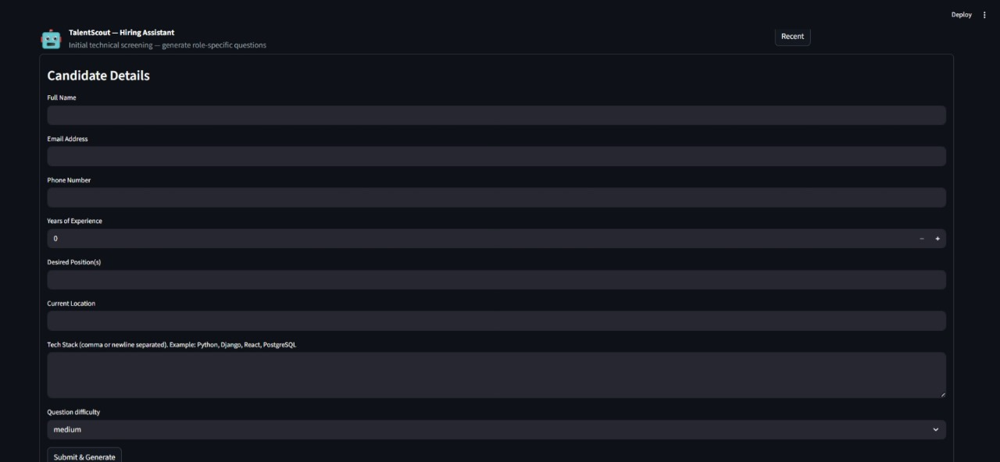
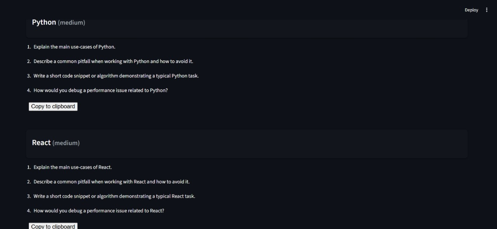
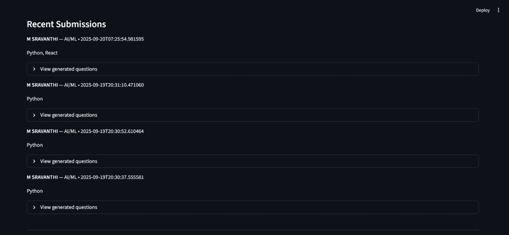

# 🎯 TalentScout — Hiring Assistant
A Streamlit-based **screening assistant** that collects candidate details and generates **role-specific technical questions** using **Mistral AI** (with a safe fallback when no API key is set).  
Designed for recruiter teams to **save time**, **standardize screening**, and **improve candidate evaluation**.

### Check out the deployed app here: [TalentScout — Streamlit App](https://talentscout12.streamlit.app/)

[](https://streamlit.io)
[](https://www.python.org/)
[](https://mistral.ai/)
[](LICENSE)
[](https://talentscout12.streamlit.app/)
---
## ✨ Features

- 📝 Candidate intake form (name, email, phone, experience, desired role, tech stack)
- 🤖 AI-powered question generation (Mistral API)  
  - 3–5 questions per declared technology  
  - Difficulty adapts to candidate’s experience  
- 🔒 Fallback template generator (works even without API key)
- 📂 Recent submissions panel (stored in DB)
- 💾 Download questions (JSON / TXT)
- 🔄 Regenerate questions for a single technology
- 🎨 Clean Streamlit UI with dark theme & collapsible panels
- 🗄️ Database ready (SQLite by default, Postgres if `DATABASE_URL` provided)

---

## 📂 Project Structure
```bash
talentscout/
├── app/
│ └── streamlit_app.py # Streamlit entry point
├── backend/
│ ├── init.py
│ ├── api_client.py # Handles Mistral API calls
│ ├── generator.py # Core logic for generating questions
│ ├── prompts.py # Prompt templates
│ ├── storage.py # Database persistence (SQLite/Postgres)
│ ├── utils.py # Helpers (parsing, cleaning)
│ └── models.py # SQLAlchemy models
├── tests/
│ └── test_generator.py # Sample unit tests
├── requirements.txt
├── environment.yml # Conda environment (optional)
├── .env.example # Example env vars
├── .gitignore
└── README.md
```
---

## 🚀 Quickstart

### 1. Clone the repo
```bash
git clone https://github.com/<your-username>/talentscout.git
cd talentscout
```
2. Create environment (conda or pip)
```bash
conda env create -f environment.yml
conda activate talentscout
```
or
```bash
pip install -r requirements.txt
```
3. Configure environment
Copy .env.example → .env and fill in:
```bash
MISTRAL_API_KEY=sk-...
MISTRAL_API_URL=https://api.mistral.ai
MISTRAL_MODEL=mistral-medium  # or other model
DATABASE_URL=                 # optional (Postgres URI), fallback is SQLite
```
4. Run locally
```bash
streamlit run app/streamlit_app.py
Open 👉 http://localhost:8501
```
### 2. ☁️ Deployment (Streamlit Cloud)
1. Push repo to GitHub.
2. Go to Streamlit Cloud.
3. Create new app → point to app/streamlit_app.py.
4. Add environment secrets:
- MISTRAL_API_KEY (required for AI-powered questions)
- DATABASE_URL (optional for persistence; SQLite otherwise)
- Deploy 🎉

### 3. 🧪 Testing
Run unit tests with:
```bash
pytest -v
```
Example test (tests/test_generator.py):
```bash
from backend.generator import generate_questions_for_techs
def test_fallback_generation():
    techs = ["Python"]
    q = generate_questions_for_techs(techs, api_key=None)
    assert "Python" in q
    assert len(q["Python"]) >= 3
```
## 📸 Screenshots

### Candidate Form


### Generated Questions


### Recent Submissions


## ⚙️ Tech Stack
1. Streamlit — UI framework
2. Mistral AI — LLM for dynamic question generation
3. SQLAlchemy — ORM & DB handling
4. [SQLite/Postgres] — storage (SQLite default, Postgres recommended for cloud)
5. [Python 3.10+] — runtime

## 🔒 Security & Privacy
- Candidate data stored locally (SQLite) or in configured DB.
- Sensitive fields (email, phone) can be anonymized if required.
- API keys are never logged; use .env or Streamlit Cloud Secrets.
- .env and *.db are in .gitignore by default.

## 📌 Limitations & Next Steps
- SQLite on Streamlit Cloud is ephemeral → use Postgres for persistence.
- Current prompt parser is JSON-based → brittle for malformed outputs.
- Future:
1. Admin dashboard for recruiters
2. Difficulty selector slider
3. Multilingual support
4. Export to PDF/CSV
